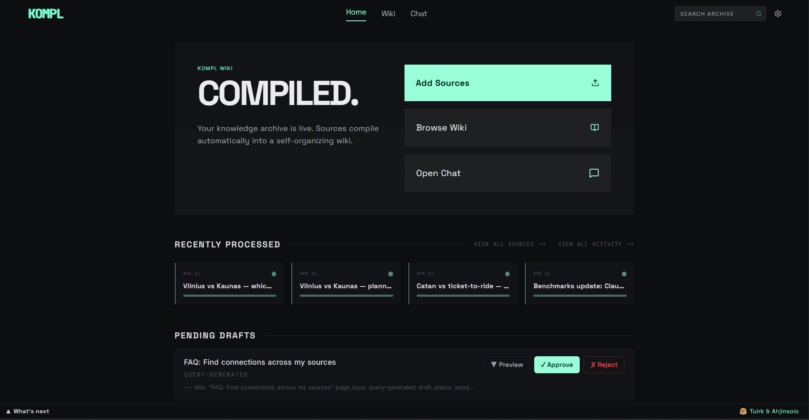
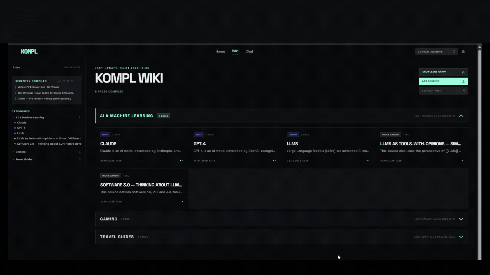
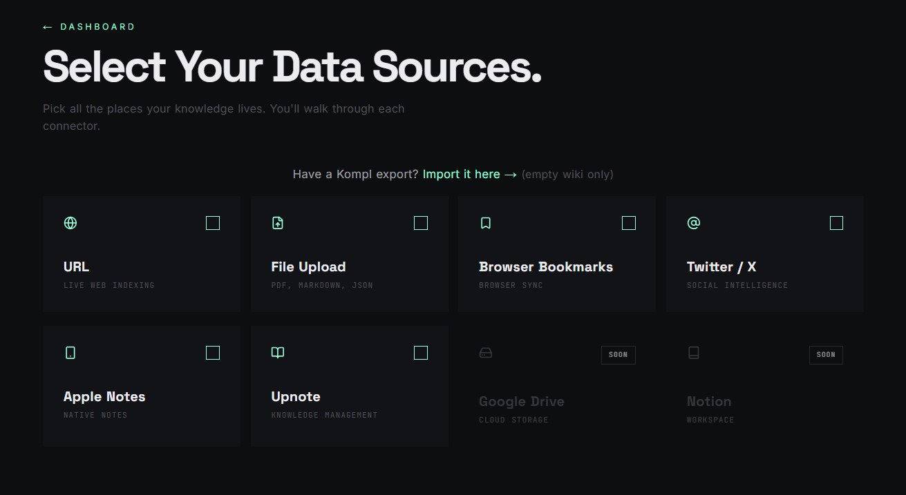

<p align="center">
  
</p>

# Kompl

Knowledge compiler — turns scattered links, files, and bookmarks into a living wiki that compounds with every new source.

[](LICENSE)
[](https://github.com/tuirk/Kompl/actions)
[](docker-compose.yml)
[]()

## Why Kompl?

Most tools save your stuff and forget about it. Kompl reads it, extracts the knowledge, and compiles it into an interlinked wiki, automatically.

- One new source can update 10+ wiki pages. Cross-references, contradictions, and synthesis are built at ingest time, not re-discovered on every query.
- Entity pages, concept pages, comparisons, and source summaries are wikilinked together. The wiki gets richer with every source you add.
- Runs locally via Docker. Outbound calls are limited to your own API keys (Gemini, Firecrawl) and the URLs you choose to ingest.

Built with Next.js, Python NLP, n8n orchestration, and SQLite.



## Before you start

You'll need three things on your machine:

- **Docker** — [Docker Desktop](https://www.docker.com/products/docker-desktop/) (Windows/Mac) or [Docker Engine + Compose plugin](https://docs.docker.com/engine/install/) (Linux). Compose v2 is required (`docker compose`, not `docker-compose`). Make sure Docker is **running** before setup.
- **[Node.js](https://nodejs.org/) ≥ 24** — to install and run the `kompl` CLI.
- **~5 GB free disk and 4 GB free RAM** — Kompl runs three containers (app, NLP service, n8n) plus pulls a ~90 MB embedding model on first compile.

You'll also need two API keys, both free to get:

| | Get key | Free tier | Notes |
|---|---|---|---|
| **Gemini** (wiki compilation) | [aistudio.google.com/apikey](https://aistudio.google.com/apikey) | 1500 req/day | Free works for the demo and your first few sources. **Paid Tier 1 is strongly recommended for real use** — Gemini's free per-minute throttle (~10 RPM) will rate-limit a normal ingest, even though daily quota is plenty. Default rate-limiter assumes Tier 1. |
| **Firecrawl** (URL scraping) | [firecrawl.dev](https://firecrawl.dev) | 500 scrapes/month | Free tier covers normal personal use. |

## Setup

```bash
git clone https://github.com/tuirk/Kompl.git kompl
cd kompl
node setup.js
```

The script handles everything: creates your config, asks for the two API keys, installs the `kompl` CLI, and starts the stack. No other steps needed. Your system timezone is detected and written to `.env` as `KOMPL_TIMEZONE` automatically.

> Your API keys land in `.env` at the repo root. That file is gitignored — never commit it.

During setup you'll be asked how this instance is running: **personal device** (laptop/desktop that may be off) or **always-on server** (VPS, Railway, Raspberry Pi). This controls how scheduled jobs — lint, digest, and local backup — are triggered. Personal-device mode fires them on `kompl start` so nothing is skipped if your machine was off at the scheduled time; always-on mode relies on n8n's built-in cron schedule.

> *⚠️ This mode toggle ships as a demo — expect rough edges, especially in the always-on server path.*

> **First start takes 5–10 minutes** — Docker is building images (~2 GB on first start) and downloading the local AI model from HuggingFace. Make a coffee. Subsequent starts take ~15 seconds.

## After setup

Check when it's ready:

```bash
kompl status
```

Then open in your browser:

```bash
kompl open
```

Or visit [http://localhost:3000](http://localhost:3000) directly.

The onboarding wizard will walk you through your first sources — paste a URL, drop a PDF, or import a Twitter bookmark export.



If something looks stuck:

```bash
kompl logs       # stream service logs
kompl status     # health check
```

Common first-run issues: Docker isn't running, port 3000 is occupied, or the first-time image build is still pulling (~2 GB).

## Day-to-day

```bash
kompl start      # start Kompl
kompl stop       # stop it
kompl restart    # stop + start in one command
kompl open       # open in browser
kompl status     # health check: page count, NLP service, vector backlog
kompl logs       # stream logs if something looks wrong
kompl update     # pull latest version and restart
kompl backup     # download a full backup to ~/.kompl/backups/kompl-backup.kompl.zip
kompl init       # re-run the first-time setup wizard (rarely needed)
```

## Use with AI agents (MCP)

Kompl ships an MCP server so any MCP-capable agent — Claude Code, Claude Desktop, Cursor, or a custom client built on `@modelcontextprotocol/sdk` — can query your compiled wiki. Ask *"what does my wiki say about X?"* and the agent gets pre-synthesized pages with provenance back to the originals, not raw chunks.

> ⚠ **Single-tenant.** Kompl assumes you own the host. There's no multi-user auth — don't expose your instance to the public internet without putting your own auth in front.

### Build the MCP server

```bash
cd mcp-server && npm install && npm run build
```

Kompl must be running (`kompl start`) for the MCP tools to respond.

### Claude Code

Create `.mcp.json` in the repo root with:

```json
{
  "mcpServers": {
    "kompl-wiki": {
      "type": "stdio",
      "command": "node",
      "args": ["mcp-server/dist/index.js"],
      "env": { "KOMPL_URL": "http://localhost:3000" }
    }
  }
}
```

Claude Code picks it up automatically next session. Try: *"search my wiki for [topic]"* or *"read the relevant page from my wiki for [topic]."*

### Claude Desktop

| OS | Config file |
|---|---|
| Windows | `%APPDATA%\Claude\claude_desktop_config.json` |
| macOS | `~/Library/Application Support/Claude/claude_desktop_config.json` |
| Linux | `~/.config/Claude/claude_desktop_config.json` (no official Linux release; convention if a build is available) |

Add the same `mcpServers` block as above, but with the **absolute** path to `mcp-server/dist/index.js` instead of relative.

### Tools

The server exposes four: `search_wiki`, `read_page`, `list_pages`, `wiki_stats`.

### Non-MCP / direct HTTP

If you're not using an MCP client, hit the Next.js routes directly: `/api/pages/search`, `/api/wiki/{page_id}/data`, `/api/wiki/index`.

## Your data

Your wiki content lives in Docker volumes on your machine. Outbound network calls fall into three buckets:

**You drive these — your content goes to a third party:**
- **Gemini** (`generativelanguage.googleapis.com`) — wiki compilation. Your source text is sent to Google.
- **Firecrawl** (`api.firecrawl.dev`) — URL scraping fallback. The URL you pasted is sent to Firecrawl.
- **GitHub public API** (`api.github.com`) — when you paste a GitHub repo URL, Kompl fetches the README + metadata.
- **YouTube** (`youtube.com`) — when you paste a YouTube URL, transcripts are fetched via the public captions endpoint.
- **OG-tag preview** — pasted URLs are fetched once with `User-Agent: KomplBot/1.0` to grab title + description.
- **Telegram** (`api.telegram.org`) — wired for the weekly digest, but the Settings UI is currently locked until two known issues are resolved. No outbound Telegram calls happen on a default install.

**One-time, on first use:**
- **HuggingFace Hub** (`huggingface.co`) — ~90 MB download of the `all-MiniLM-L6-v2` embedding model on the first compile. After that, no further HF traffic.

**Build-time only:** Docker image builds pull from PyPI, npm, Docker Hub, and apt mirrors. No runtime impact.

Kompl itself sends no analytics, no error reports, and no version pings. The bundled n8n container's upstream telemetry, version checks, templates, and personalization are disabled by default in `docker-compose.yml`.

## Backup and restore

Settings → **Kompl Backup** downloads a `.kompl.zip` containing your entire wiki: sources, compiled pages, provenance, extractions, and settings. API keys and third-party secrets are excluded. No LLM calls needed to restore.

To restore on a fresh instance: run setup, skip onboarding, go to Settings → **Import Wiki**, upload the `.kompl.zip`. All pages are immediately browsable and searchable. The search index rebuilds in the background after restore.

### Automatic backup

If you chose **personal-device** mode during setup, `kompl start` automatically saves a local backup to `~/.kompl/backups/kompl-backup.kompl.zip` (at most once every 36 hours). Settings shows when the last backup ran.

> *⚠️ Auto-backup-on-start is an early feature, wired end-to-end but lacking regression tests on the start-time path. Flag any silent skips.*

### CLI backup

```bash
kompl backup                                          # save to ~/.kompl/backups/kompl-backup.kompl.zip (overwrites)
kompl backup --output ~/Desktop/my-wiki.kompl.zip     # save to a custom path
kompl backup --schedule                               # register a weekly backup schedule (Monday 11:30)
```

`--schedule` is idempotent. Platform-specific behavior:

- **Windows** — registers a Task Scheduler entry (requires Admin). `StartWhenAvailable` means it runs on next login if the laptop was off at 11:30.
- **Linux** — appends a crontab entry (`30 11 * * 1 kompl backup`) for the current user. Standard cron does not catch up if the machine was off.
- **macOS** — uses crontab, same as Linux. Same caveat applies (cron does not catch up if the machine was off). *Tested on Windows and Linux only — please [open an issue](https://github.com/tuirk/Kompl/issues) if you hit anything weird on Mac.*

## Heads up

**⚠️ Integration tests wipe the database.** `bash scripts/integration-test.sh` is destructive — it resets everything. Never run it on a wiki you want to keep. Use `kompl backup` first.

**Known limitations:**
- Single-tenant only — no user accounts or access control. Don't expose to the public internet without your own auth layer.
- Gemini is the only LLM provider. Anthropic and OpenAI-compatible providers are planned.
- **Current connectors:** URLs (YouTube transcripts and GitHub READMEs included), file uploads (PDF, DOCX, PPTX, XLSX, TXT, MD, HTML), browser bookmarks, Twitter JSON export, Upnote, Apple Notes.
- Personal-device vs always-on-server mode is a demo feature — the always-on server path hasn't been hardened yet.
- No mobile app. The web UI works on mobile browsers but isn't optimized for small screens.

## License

Kompl's source is **Apache-2.0** — see [LICENSE](LICENSE). You can use, modify, fork, and redistribute it freely under those terms.

**One caveat about the bundled n8n container.** Kompl runs `n8nio/n8n` as an unmodified runtime dependency for workflow orchestration. n8n itself is licensed under the [Sustainable Use License](https://docs.n8n.io/sustainable-use-license/), which is **not OSI-approved**. In practice:

- Self-hosting Kompl for personal or internal use → fully fine.
- Forking and redistributing Kompl source → fine (Apache-2.0 covers Kompl; n8n is a runtime dep users pull themselves).
- Offering **Kompl-as-a-hosted-service to third parties** → this is the line. n8n's SUL restricts hosting n8n as a service for others; if your offering bundles n8n, contact n8n first.

See [NOTICE](NOTICE) for full attribution.
